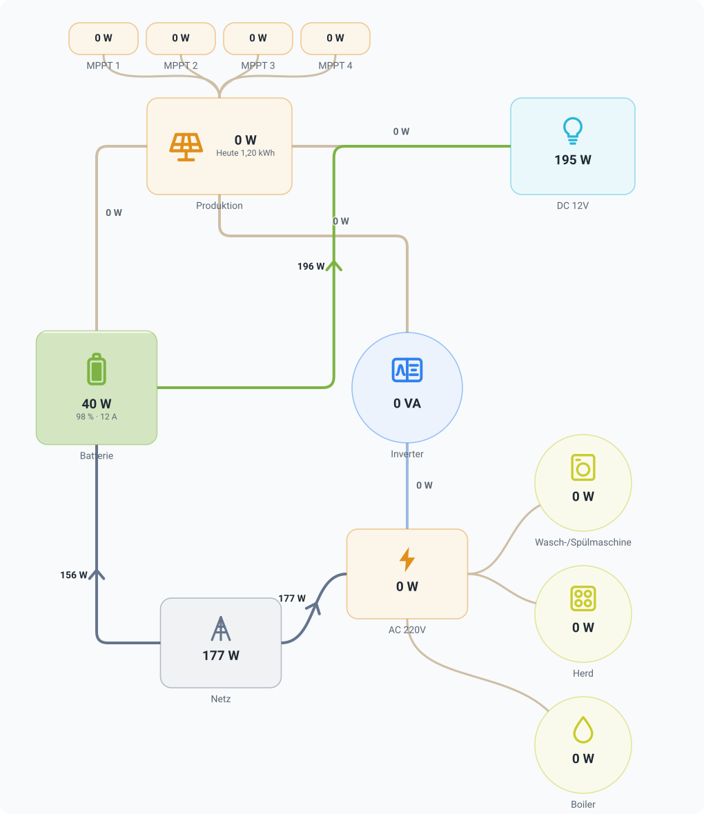

# ioBroker.flow

[](https://www.npmjs.com/package/iobroker.flow)
[](https://www.npmjs.com/package/iobroker.flow)
[](LICENSE)

A freely arrangeable, animated flow diagram — usable in **ioBroker.vis-2** and in the
**ioBroker.devices** widget manager, from the same configuration, with the same designer. Energy is
what it was built for; water, gas and heat flow through the same lines.

<picture>
  <source media="(prefers-color-scheme: dark)" srcset="src-widgets/public/img/prev_hybrid-12v-dark.svg">
  
</picture>

*A real installation — four MPPT chargers, a 12 V battery bank, a DC branch, an inverter, grid and
three appliances. It ships as [`examples/hybrid-12v.json`](examples/README.md) and can be imported as
it is.*

## What it does

You place producers, consumers, storage and the grid on a canvas, connect them, and say which ioBroker
state carries which number. The diagram then shows how much is flowing and in which direction, with dots
that move faster the more power there is.

- **A designer, not a list of fields.** Drag the nodes, drag a connection from one to the next. No
  fixed number of producer slots, no "node 7" attributes. Select several nodes with a frame or with
  Shift/Ctrl+click, move them together — with the mouse or the arrow keys, Shift+arrow keys resize —,
  copy them with Ctrl+C / Ctrl+V (⌘ on a Mac), also from one diagram into another, and delete them
  with Del. The middle piece of a right-angled line can be dragged sideways; a double click puts it
  back.
- **Styles.** *Normal* (outlined boxes, the label below), *Clean* (white cards with a soft shadow,
  label and icon inside, arrowheads where the energy arrives), *3D* (neumorphism: cards raised out
  of the surface by a light and a dark shadow) and *Neon* (glowing lines and outlines on deep navy; a
  round node shows its level as a glowing ring). Every style follows the light or dark theme of the
  admin or the vis project; it only changes how boxes and lines are drawn.
- **Fill levels.** A battery fills with its state of charge — the node and its icon. Any other node
  can fill against a maximum: a 1400 W array at 75 W is 5 % full. The maximum comes from the state
  object (`common.max`) when it has one, so an inverter that declares its rating needs nothing typed
  in; a number on the node wins, a 0 switches the fill off. The charge level can simply be
  "the same as the value", with its own conversion, and a node whose value itself is in % draws its
  battery icon at that level.
- **Values that fit.** A value too long for its box — "-1.800,00 W" in a small one — is set smaller
  instead of running over the edge.
- **Energy, water, gas or heat.** A new diagram is asked what it carries, and with that come the unit, the speed
  of the dots, the value below which a line is idle, the words in the designer ("source" instead of
  "producer"), what the assistant searches for, and the templates — a water meter with house and
  garden, rain water in a cistern, a gas meter with heating and stove, a heat pump filling a buffer.
  Everything it sets stays editable, and a diagram that says nothing is an energy diagram — as
  every one written so far is.
- **The diagram works the flow out.** Switch it on and the lines need no state of their own: a shut
  valve or a standing pump stops the flow, an empty tank gives nothing, a pump pushes the way it is
  drawn, and a flow sensor says how much — which is then divided over the branches: two taps behind
  one pump get half each, or exactly what they read if they read anything, or one part against two
  where one of their valves is only half open. A ring works too: fed from one end both halves carry
  half, fed from both ends the two flows meet somewhere in the middle and that pipe carries nothing.
  What a person reading the picture would say — which tank feeds the tap and which branch is shut off —
  the diagram now says by itself.
- **A caption that says something.** The text of a caption may carry placeholders: `{{ val }}` is the
  value of a state, `{{ ts }}` when it was last written ("5 minutes ago"), `{{ unit }}` its unit, and
  `{{ 0_userdata.0.x.val }}` any other state. It may compute as well: `{{ val * 10 }}`.
- **Values on the lines, your way.** Next to the line, or in a rounded chip sitting on it — one
  setting for the whole diagram.
- **Icons for what is actually in a house.** Over fifty drawn ones: photovoltaics, wind, water
  power, battery and heat store, grid, meter, wallbox and car, heat pump, radiator, electric heater,
  air conditioner, ventilation, fan, water pump, water heater, washing machine, dishwasher, tumble
  dryer, fridge, freezer, oven, cooktop, microwave, coffee machine, TV, server, pool, light — plus
  "all consumers" for the sum of a house. For water: well, rain, cistern, pipe, water meter, flow
  sensor, valve, filter, pump, sprinkler, shower, basin, tap and pond. Any image of your own works too (URL or data
  URI). Two of them show a level rather than a fixed mark — the battery its charge, the **tank** what
  is in it, water rising past the scale on its wall.
- **The palette follows the medium.** A water installation is not built from "a bus": the designer
  offers a source, a tank, the house connection, a consumer — and, for the things that sit *in* the
  pipe, a meter, a flow sensor, a pump, a valve and a plain junction, each with the right symbol. An
  energy diagram keeps the palette it always had.
- **A valve is open or closed, and you can see it.** A valve and a pump are placed ready to take a
  state: a boolean reads as "open"/"closed", a percentage as the number it is, and either way the
  element carries the colour of its medium while it is on and turns grey at zero.
- **Rules.** "Below 20 % red and blinking", "status Error in red": colour, icon and blinking follow the
  value; the first rule that matches wins, and the lines take the colour along.
- **Status texts.** A state such as an inverter mode is shown as text, optionally translated
  (`1` → "Charging").
- **Stale values are visible.** A node whose state has not been updated for a set time is dimmed — an
  adapter that hangs no longer looks like a quiet house.
- **Energy of the day.** Under the value, either read from a counter of the device — the "yield
  today" of an inverter — or integrated from the history adapter since midnight.
- **Key figures.** Autarky and self-consumption in %, computed from the producers, grid and storage of
  the diagram.
- **Colour by value.** A node — and its lines — goes from green to red with a value, e.g. the
  electricity price.
- **Detail view.** The click action "Show history" opens the value over 1 h … 30 days with minimum,
  average and maximum.
- **Save as picture.** SVG or PNG straight from the designer, without grid and handles.
- **Build from my devices.** An assistant looks for the states that report power, guesses what they
  are and lays out a first diagram — producers on top, grid left, storage right, consumers below.
- **A chart in the node.** With a history adapter (history, sql, influxdb) any node can draw its value
  over the last 15 minutes to 24 hours behind the number.
- **When it last changed.** A node can show under its value when the state last changed or was last
  updated — "12 minutes ago", a clock time or a date, in the language of the browser.
- **Units from the states.** A value takes its unit from the state object (`common.unit`), so a
  battery reporting kW and an inverter reporting W sit side by side without configuration: both are
  shown correctly, a node that adds them up adds watts to watts, and the dots move at the same speed
  for the same power. A unit set on the node or connection still wins.
- **Templates to start from.** PV + grid + house, with a battery, plus a wallbox or a heat pump. Pick
  one and you only have to fill in the state ids. `examples/` has complete diagrams of real
  installations to import and adapt.
- **A node works out its own value** from the lines that meet it, so the classic four-box diagram
  needs three state ids and not seven.
- **One state per connection, not two.** A grid meter or a battery reports a signed value: positive one
  way, negative the other. That is one connection in the diagram, and the direction, the colour and the
  animation follow the sign.
- **Units that scale themselves.** Say a value is in `W` once and the diagram shows `734 W`, `8.73 kW`
  or `2.5 MW` depending on what is actually flowing.
- **Formulas where a single state is not enough.** `sum(inverter1, inverter2)`, `pv - feedIn`,
  `if(soc > 95, 0, charge)` — with a factor, an offset, a dead band and a sign switch for the ordinary
  rescaling cases.
- **Scales into whatever box it is in.** One SVG with a `viewBox`: a full-width vis-2 view, or a 1×1
  card in the device manager.
- **Animation that stops when nobody is looking.** Paused in a hidden browser tab and while the widget
  is scrolled out of view, and it respects `prefers-reduced-motion` (a static arrow then shows the
  direction instead).

## Install

```bash
# from the ioBroker admin, or:
iobroker add flow
```

The adapter ships no Node.js code (`onlyWWW`), but it needs an instance so that vis-2 and the device
manager can find it. vis-2 is restarted automatically after the installation.

### In the admin, without opening vis

The adapter adds a tab **Flow** to the admin. It lists the stored diagrams and edits them in the
same designer, full page. A diagram saved there reaches every vis-2 widget and every device-manager card
that shows it the moment you press save — no reload, no vis editor.

A switch in the toolbar saves by itself, ten seconds after the last change — a whole afternoon of
dragging without touching the save button. It is a preference of the browser it was switched on in.

Stored diagrams live as objects `flow.0.diagrams.<id>`, one per diagram, of type `config` with the
document in `native.flow`. That is also why they can be backed up, restored and scripted like any
other object.

### Export and import

- **One diagram** — *Export* in the diagram's **⋮** menu saves it as `<name>.json`. The file is exactly
  what a widget stores, so it can also be pasted into any designer's **`< >`** dialog.
- **All diagrams** — the download button above the list saves every stored diagram into one file, for
  a backup or to move a set to another installation.
- **Import** — the upload button above the list takes one or several files: single diagrams, a file of
  all diagrams, or an `energiefluss-erweitert` configuration. You see what each file contains and what
  a conversion had to leave out before anything is created. Every diagram becomes a new one; existing
  diagrams are never overwritten, not even one with the same name.

What is exported is what is stored: unsaved changes in the designer are not included, and you are told
so.

### In vis-2

Add the **Flow diagram** widget from the *Flow* set. Its attribute offers two modes:

- **Stored diagram** — pick one of the diagrams from the admin tab. The widget holds only a reference;
  edit the diagram in the admin, or open the designer from here, which edits the same stored diagram.
- **In this widget** — the diagram lives inside the widget and travels with a view export.
  **Store centrally** moves it into the admin tab and switches the widget to the reference.

### Importing a ready-made diagram

The designer's **`< >`** button opens the document as JSON: paste one of the files from `examples/`
over it, or open the file with the folder button, and press apply. The same dialog copies or downloads
a finished diagram, for a second widget or another installation. To add a file as a diagram of its own
instead of replacing the one being edited, use *Import* in the admin tab.

### In ioBroker.devices

In the widget manager, add a widget to a category and pick **Flow diagram** from the plugin section at
the bottom of the list. The settings dialog of the card has the same two modes as in vis-2, so one
stored diagram can be shown in vis-2 and in the device manager at the same time.

> The devices side needs `ioBroker.devices` with the widget manager and `@iobroker/json-config` 10 —
> older versions do not know the plugin mechanism this uses.

### In another adapter's admin configuration

The designer is a `jsonConfig` custom component, and an adapter's configuration page is rendered by the
same `@iobroker/json-config` as the device manager's settings dialog. So any adapter can embed it by
putting one item into its `jsonConfig.json`:

```json
{
    "diagram": {
        "type": "custom",
        "url": "./adapter/flow/dm-widgets/customDevices.js",
        "name": "flow/Config/Designer",
        "guiApi": 2,
        "i18n": false,
        "newLine": true
    }
}
```

The edited diagram lands in `native.diagram` of that adapter, as an ordinary object — read it back with
`normalizeConfig()` and render it with `FlowView`, or just store it.

Three things this relies on:

- **ioBroker.flow has to be installed**, because the `url` is served from its `admin` folder.
  Declare it under `common.dependencies` (`[{ "flow": ">=0.0.1" }]`) so the installation pulls
  it in. `ifInstalledDependencies` is *not* enough — it only checks the version when the adapter
  happens to be there, and otherwise the form shows a load error instead of the designer.
- **`guiApi: 2`** says the component is built for React 19 / MUI 9. An older admin refuses it rather
  than crashing, which is the point of the field.
- The **leading `./`** is not decoration. Without it the URL is resolved relative to the adapter whose
  configuration is being shown, and that is not this one.

The component brings its own translations, so nothing else has to be registered.

### Bringing an existing diagram over

Paste the content of the `energiefluss-erweitert.0.configuration` state into the designer's **`< >`**
dialog, or save it as a file and import it in the admin tab. It is recognised, converted and summarised
before anything is applied.

The two formats disagree about one thing, and the conversion is mostly about that: over there a box is
not an object. What you see as "the battery" is a rectangle, an icon and two texts that merely overlap,
and nothing says they belong together. What *is* explicit is the graph — a connection is stored under
the key `path_<a>_<b>`, naming the two rectangles it runs between. So the importer takes those
rectangles as the nodes and gives every other element to the box that contains it, which is what your
eye does anyway.

Carried over: the boxes with their position, size, shape and colour, the labels, the icons (matched by
keyword, so `mdi:house-city` and `material-symbols:electric-car` land correctly), the state ids
including `add`/`subtract`/`convert` as a formula, the units and decimals including the `calculate_kw`
modes, the connections with their direction, sides, colour and threshold.

Not carried over, and reported rather than dropped quietly: per-element CSS, click actions, images, and
values that show something other than the state's value. You get a list of what was affected before you
press import.

What is missing so far: reading history, so there is no min/max over the last day.

## Development

This is one npm workspace with three bundles, a development preview and three shared source packages.

```
packages/core/       model, value resolution, geometry, SVG renderer — no MUI, no socket
packages/editor/     the designer (MUI + @iobroker/gui-components)
packages/i18n/       the dictionary, used by both bundles
examples/            complete diagrams to import; `npm test` checks they stay valid
src-widgets/         the vis-2 widget set   -> widgets/flow/
src-dm-widgets/      the devices plugin     -> admin/dm-widgets/
src-admin/           the admin tab          -> admin/tab.html + admin/tab-assets/
src-preview/         dev server only: the admin-side GUI with hot reload, never built or shipped
```

```bash
npm install          # installs all three bundles and hoists the shared copies — do this at the root
npm run build        # previews + all three bundles, into widgets/ and admin/
npm run build-vis    # only the vis-2 bundle
npm run build-dm     # only the devices bundle
npm run build-admin  # only the admin tab
npm run dev          # the preview on http://localhost:3100, against a running ioBroker
npm run previews     # re-render the palette preview from the real renderer
npm run check        # type check the shared packages, tasks.ts, tools/ and the tests
npm run lint
npm test             # unit tests of the core plus the ioBroker package checks
```

`npm install` must be run **at the root**: `packages/core` and `packages/editor` are compiled into both
bundles and have to see the same copy of React and MUI as the bundle around them, which is what the
workspace hoisting arranges.

### Working on the GUI

`npm run dev` starts `src-preview`: the admin tab, the widget as a view draws it (with live values and
a width slider) and the attribute editor of vis-2 / devices / adapter configurations, each on a page of
its own, with hot reload. It compiles the same sources as the real bundles, so there is no build and no
`iobroker upload` between an edit and seeing it.

It talks to the admin at `ADMIN_URL` in `src-preview/vite.config.ts`, `http://localhost:8081` by
default. For another machine change that constant, e.g. to `'http://vitanova:8081'`, or set it for one
run: `IOBROKER_ADMIN=http://vitanova:8081 npm run dev`. The admin must be reachable without a login
from the browser, as for any ioBroker dev server.

`cd src-widgets && npm start` is the widget's own dev server (Vite on port 4173, proxying to an ioBroker
web adapter on 8082); it needs a running vis-2 to show anything.

### Translations

`packages/i18n/src/*.json` — `en` and `de` are complete, the other nine languages are empty on purpose:
`I18n.t` falls back to English for a missing key, and an empty file says "not translated yet" where a
copy of the English would claim otherwise. Contributions welcome.

## Changelog
<!--
    Placeholder for the next version (at the beginning of the line):
    ### **WORK IN PROGRESS**
-->
### **WORK IN PROGRESS**

* (bluefox) Initial release

## License

MIT License

Copyright (c) 2026 bluefox <dogafox@gmail.com>

Permission is hereby granted, free of charge, to any person obtaining a copy
of this software and associated documentation files (the "Software"), to deal
in the Software without restriction, including without limitation the rights
to use, copy, modify, merge, publish, distribute, sublicense, and/or sell
copies of the Software, and to permit persons to whom the Software is
furnished to do so, subject to the following conditions:

The above copyright notice and this permission notice shall be included in all
copies or substantial portions of the Software.

THE SOFTWARE IS PROVIDED "AS IS", WITHOUT WARRANTY OF ANY KIND, EXPRESS OR
IMPLIED, INCLUDING BUT NOT LIMITED TO THE WARRANTIES OF MERCHANTABILITY,
FITNESS FOR A PARTICULAR PURPOSE AND NONINFRINGEMENT. IN NO EVENT SHALL THE
AUTHORS OR COPYRIGHT HOLDERS BE LIABLE FOR ANY CLAIM, DAMAGES OR OTHER
LIABILITY, WHETHER IN AN ACTION OF CONTRACT, TORT OR OTHERWISE, ARISING FROM,
OUT OF OR IN CONNECTION WITH THE SOFTWARE OR THE USE OR OTHER DEALINGS IN THE
SOFTWARE.
