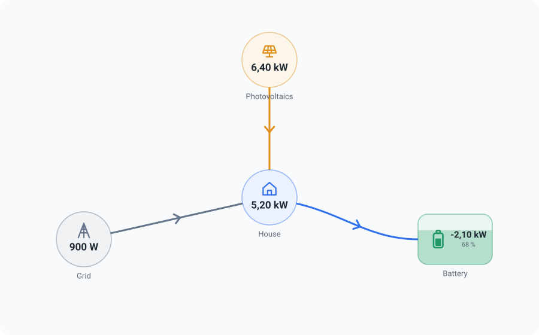

# ioBroker.energyflow

[](https://www.npmjs.com/package/iobroker.energyflow)
[](https://www.npmjs.com/package/iobroker.energyflow)
[](LICENSE)

A freely arrangeable, animated energy flow diagram — usable in **ioBroker.vis-2** and in the
**ioBroker.devices** widget manager, from the same configuration, with the same designer.



## What it does

You place producers, consumers, storage and the grid on a canvas, connect them, and say which ioBroker
state carries which number. The diagram then shows how much is flowing and in which direction, with dots
that move faster the more power there is.

- **A designer, not a list of fields.** Drag the nodes, drag a connection from one to the next. No
  fixed number of producer slots, no "node 7" attributes.
- **Templates to start from.** PV + grid + house, with a battery, plus a wallbox or a heat pump. Pick
  one and you only have to fill in the state ids. `examples/` has complete diagrams of real
  installations to import and adapt.
- **A node works out its own value** from the lines that meet it, so the classic four-box diagram
  needs three state ids and not seven.
- **One state per connection, not two.** A grid meter or a battery reports a signed value: positive one
  way, negative the other. That is one connection in the diagram, and the direction, the colour and the
  animation follow the sign.
- **Units that scale themselves.** Say a value is in `W` once and the diagram shows `734 W`, `8.73 kW`
  or `2.5 MW` depending on what is actually flowing.
- **Formulas where a single state is not enough.** `sum(inverter1, inverter2)`, `pv - feedIn`,
  `if(soc > 95, 0, charge)` — with a factor, an offset, a dead band and a sign switch for the ordinary
  rescaling cases.
- **Scales into whatever box it is in.** One SVG with a `viewBox`: a full-width vis-2 view, or a 1×1
  card in the device manager.
- **Animation that stops when nobody is looking.** Paused in a hidden browser tab and while the widget
  is scrolled out of view, and it respects `prefers-reduced-motion` (a static arrow then shows the
  direction instead).

## Install

```bash
# from the ioBroker admin, or:
iobroker add energyflow
```

The adapter ships no Node.js code (`onlyWWW`), but it needs an instance so that vis-2 and the device
manager can find it. vis-2 is restarted automatically after the installation.

### In vis-2

Add the **Energy flow diagram** widget from the *Energy flow* set, then press **Open designer** in the
widget attributes.

### Importing a ready-made diagram

The designer's **`< >`** button opens the document as JSON: paste one of the files from `examples/`
over it and press apply. The same button copies a finished diagram into a second widget.

### In ioBroker.devices

In the widget manager, add a widget to a category and pick **Energy flow** from the plugin section at
the bottom of the list. The settings dialog of the card has the same designer.

> The devices side needs ioBroker.devices with the widget manager and `@iobroker/json-config` 10 —
> older versions do not know the plugin mechanism this uses.

### In another adapter's admin configuration

The designer is a `jsonConfig` custom component, and an adapter's configuration page is rendered by the
same `@iobroker/json-config` as the device manager's settings dialog. So any adapter can embed it by
putting one item into its `jsonConfig.json`:

```json
{
    "diagram": {
        "type": "custom",
        "url": "./adapter/energyflow/dm-widgets/customDevices.js",
        "name": "energyflow/Config/Designer",
        "guiApi": 2,
        "i18n": false,
        "newLine": true
    }
}
```

The edited diagram lands in `native.diagram` of that adapter, as an ordinary object — read it back with
`normalizeConfig()` and render it with `EnergyFlowView`, or just store it.

Three things this relies on:

- **ioBroker.energyflow has to be installed**, because the `url` is served from its `admin` folder.
  Declare it under `common.dependencies` (`[{ "energyflow": ">=0.0.1" }]`) so the installation pulls
  it in. `ifInstalledDependencies` is *not* enough — it only checks the version when the adapter
  happens to be there, and otherwise the form shows a load error instead of the designer.
- **`guiApi: 2`** says the component is built for React 19 / MUI 9. An older admin refuses it rather
  than crashing, which is the point of the field.
- The **leading `./`** is not decoration. Without it the URL is resolved relative to the adapter whose
  configuration is being shown, and that is not this one.

The component brings its own translations, so nothing else has to be registered.

## Compared with `iobroker.energiefluss-erweitert`

This is a rebuild of the same idea, so the differences are worth being explicit about.

| | energiefluss-erweitert | this |
|---|---|---|
| Where it runs | Its own web app in an iframe | A real vis-2 widget and a device-manager card |
| Where the configuration lives | In the adapter, per instance | In the widget, so it travels with a view export |
| Connections | Paths drawn by hand and stored as SVG; moving a node invalidates them | Computed from the two nodes on every render; moving a node is free |
| Bidirectional flows | Two states and two elements | One signed state |
| Unit conversion | A switch per element | Derived from the unit |
| Arithmetic | A fixed list of cases | A small formula language |
| Sizing | Fixed pixels | Scaled by `viewBox` |
| CPU when idle | A manual "low performance" switch | Paused automatically |
| Reaches the device manager | No | Yes |

Its configurations can be imported — see below.

### Bringing an existing diagram over

Paste the content of the `energiefluss-erweitert.0.configuration` state into the designer's **`< >`**
dialog. It is recognised, converted and summarised before anything is applied.

The two formats disagree about one thing, and the conversion is mostly about that: over there a box is
not an object. What you see as "the battery" is a rectangle, an icon and two texts that merely overlap,
and nothing says they belong together. What *is* explicit is the graph — a connection is stored under
the key `path_<a>_<b>`, naming the two rectangles it runs between. So the importer takes those
rectangles as the nodes and gives every other element to the box that contains it, which is what your
eye does anyway.

Carried over: the boxes with their position, size, shape and colour, the labels, the icons (matched by
keyword, so `mdi:house-city` and `material-symbols:electric-car` land correctly), the state ids
including `add`/`subtract`/`convert` as a formula, the units and decimals including the `calculate_kw`
modes, the connections with their direction, sides, colour and threshold.

Not carried over, and reported rather than dropped quietly: per-element CSS, click actions, images, and
values that show something other than the state's value. You get a list of what was affected before you
press import.

What is missing so far: reading history, so there is no min/max over the last day, and storing a layout
centrally so that one diagram can be shared between several widgets. The document schema has the hook
for the second one (`{ "$ref": "…" }`) but nothing resolves it yet.

## Development

This is one npm workspace with two bundles and three shared source packages.

```
packages/core/       model, value resolution, geometry, SVG renderer — no MUI, no socket
packages/editor/     the designer (MUI + @iobroker/gui-components)
packages/i18n/       the dictionary, used by both bundles
examples/            complete diagrams to import; `npm test` checks they stay valid
test/fixtures/       the default layout of energiefluss-erweitert, the importer's test input
src-widgets/         the vis-2 widget set   -> widgets/energyflow/
src-dm-widgets/      the devices plugin     -> admin/dm-widgets/
```

```bash
npm install          # installs both bundles and hoists the shared copies — do this at the root
npm run build        # previews + both bundles, into widgets/ and admin/dm-widgets/
npm run build-vis    # only the vis-2 bundle
npm run build-dm     # only the devices bundle
npm run previews     # re-render the palette preview from the real renderer
npm run check        # type check the shared packages, tasks.ts, tools/ and the tests
npm run lint
npm test             # unit tests of the core plus the ioBroker package checks
```

`npm install` must be run **at the root**: `packages/core` and `packages/editor` are compiled into both
bundles and have to see the same copy of React and MUI as the bundle around them, which is what the
workspace hoisting arranges.

Dev servers: `cd src-widgets && npm start` (Vite on port 4173, proxying to an ioBroker web adapter on
8082).

### Translations

`packages/i18n/src/*.json` — `en` and `de` are complete, the other nine languages are empty on purpose:
`I18n.t` falls back to English for a missing key, and an empty file says "not translated yet" where a
copy of the English would claim otherwise. Contributions welcome.

## Changelog
<!--
    Placeholder for the next version (at the beginning of the line):
    ### **WORK IN PROGRESS**
-->
### **WORK IN PROGRESS**

* (bluefox) Initial release

## License

MIT License

Copyright (c) 2026 bluefox <dogafox@gmail.com>

Permission is hereby granted, free of charge, to any person obtaining a copy
of this software and associated documentation files (the "Software"), to deal
in the Software without restriction, including without limitation the rights
to use, copy, modify, merge, publish, distribute, sublicense, and/or sell
copies of the Software, and to permit persons to whom the Software is
furnished to do so, subject to the following conditions:

The above copyright notice and this permission notice shall be included in all
copies or substantial portions of the Software.

THE SOFTWARE IS PROVIDED "AS IS", WITHOUT WARRANTY OF ANY KIND, EXPRESS OR
IMPLIED, INCLUDING BUT NOT LIMITED TO THE WARRANTIES OF MERCHANTABILITY,
FITNESS FOR A PARTICULAR PURPOSE AND NONINFRINGEMENT. IN NO EVENT SHALL THE
AUTHORS OR COPYRIGHT HOLDERS BE LIABLE FOR ANY CLAIM, DAMAGES OR OTHER
LIABILITY, WHETHER IN AN ACTION OF CONTRACT, TORT OR OTHERWISE, ARISING FROM,
OUT OF OR IN CONNECTION WITH THE SOFTWARE OR THE USE OR OTHER DEALINGS IN THE
SOFTWARE.
